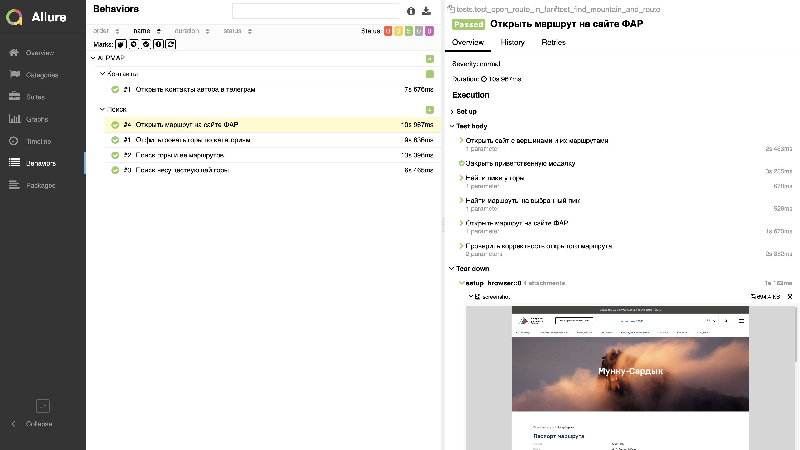

<h1> Тестирование сайта alpmap.ru </h1>

**Проект реализован с использованием:** 

<p>


 
<p>

> <a target="_blank" href="https://alpmap.ru/">Ссылка на сайт</a>


---
## 📖 Содержание

1. [Проект](#-описание-проекта)
2. [Технологии](#технологии)
3. [Реализованные тесты](#список-проверок-реализованных-в-автотестах)
   - [UI-тесты](#ui-тесты)
4. [Запуск тестов](#запуск-проекта)
   - [Локальный запуск](#локальный-запуск-проекта)
   - [Запуск в Jenkins](#-запуск-проекта-в-jenkins)
5. [Отчетность](#пример-отчета-о-прохождении-ui-теста)
6. [Уведомления](#-оповещение-о-результатах-прогона-тестов-в-telegram)
7. [Демонстрация](#-видео-прохождения-ui-автотеста)

---
## ✅ Описание проекта
1. Данный проект посвящён автоматизации UI-тестирования веб-приложения **alpmap.ru - сервис поиска маршрутов на вершины**. 
2. В рамках проекта реализованы UI-автотесты, проверяющие основную функциональность. Тесты написаны на языке Python с использованием фреймворка Selene. 
3. Результаты выполнения тестов анализируются с помощью системы отчётности Allure.

---

## Список проверок, реализованных в автотестах:


### UI-тесты

✅ Открыть страницу alpmap.ru 
✅ Закрыть всплывающее уведомление
✅ Найти вершину по названию
✅ Найти маршруты по названию пика у вершины
✅ Сопоставить найденные маршруты с ожидаемыми

---

## Запуск проекта

### Локальный запуск проекта

Запуск всех тестов

```bash
pytest .
```

###  Запуск проекта в Jenkins

1. Открыть [Проект в Jenkins](https://jenkins.autotests.cloud/job/23-alenpanova-lesson-14/)
2. Выбрать пункт `Build now`
3. Результат запуска сборки можно посмотреть в отчёте [Allure](https://jenkins.autotests.cloud/job/23-alenpanova-lesson-14/allure/)


---
#### Пример отчета о прохождении ui-теста



---

####  Оповещение о результатах прогона тестов в Telegram


---

####  Видео прохождения ui-автотеста

